# marksmen

**The origin of the name:** `marksmen` (plural) establishes the core capability that *we want to be skilled at converting any document format to any other document format* natively.

`marksmen` is a Rust workspace for converting Markdown into editable and publishable document formats while preserving as much structural information as possible for roundtrip extraction.

Current targets include:
- `PDF`
- `DOCX`
- `ODT`
- `HTML`

The workspace also includes companion reader crates for extracting Markdown-like content back from those formats, plus roundtrip tests and example binaries.

## What It Does

- Parses Markdown with frontmatter into a shared event stream.
- Converts the same source into multiple output formats.
- Extracts Markdown-like text back from generated or existing documents.
- Supports inline and display math.
- Renders Mermaid-style diagrams through a native Rust layout pipeline.
- Measures roundtrip similarity by re-extracting generated documents back into Markdown-like text.

## Forward And Reverse Conversion



`marksmen` is not just a Markdown exporter. The workspace also includes reader crates for pulling structure back out of `PDF`, `DOCX`, `ODT`, and `HTML` so those paths can be tested for symmetry and used in extraction workflows.

## Workspace Layout

- `crates/marksmen`
  The CLI entry point.
- `crates/marksmen-core`
  Shared config, frontmatter parsing, and Markdown parsing.
- `crates/marksmen-pdf`
  Markdown to PDF via Typst.
- `crates/marksmen-docx`
  Markdown to DOCX.
- `crates/marksmen-odt`
  Markdown to ODT.
- `crates/marksmen-html`
  Markdown to HTML.
- `crates/marksmen-mermaid`
  Native Mermaid parsing, layout, and rendering support.
- `crates/marksmen-docx-read`
  DOCX back to Markdown-like text.
- `crates/marksmen-odt-read`
  ODT back to Markdown-like text.
- `crates/marksmen-pdf-read`
  PDF text extraction for roundtrip evaluation.
- `crates/marksmen-html-read`
  HTML back to Markdown-like text.
- `crates/marksmen-roundtrip`
  Similarity tests and roundtrip assessment harnesses.
- `examples`
  Small runnable examples for creation, conversion, roundtrips, and symmetry checks.

## Programmatic Conversion

Export Markdown to multiple document formats:

```rust
use anyhow::Result;
use marksmen_core::Config;
use marksmen_core::config::frontmatter::parse_frontmatter;
use marksmen_core::parsing::parser::parse;

fn convert_all(markdown: &str) -> Result<()> {
    let config = Config::default();
    let (body, _) = parse_frontmatter(markdown)?;

    let html = marksmen_html::convert(parse(body), &config)?;
    let docx = marksmen_docx::translation::document::convert(parse(body), &config, &std::env::current_dir()?)?;
    let odt = marksmen_odt::translate_and_render(&parse(body), &config, &std::env::current_dir()?)?;
    let pdf = marksmen_pdf::convert(markdown, &config, Some(std::env::current_dir()?))?;

    println!("html chars: {}", html.len());
    println!("docx bytes: {}", docx.len());
    println!("odt bytes: {}", odt.len());
    println!("pdf bytes: {}", pdf.len());
    Ok(())
}
```

Convert existing document formats back to Markdown-like text:

```rust
use anyhow::Result;

fn read_back(docx_bytes: &[u8], odt_bytes: &[u8], pdf_bytes: &[u8], html: &str) -> Result<()> {
    let from_docx = marksmen_docx_read::parse_docx(docx_bytes)?;
    let from_odt = marksmen_odt_read::parse_odt(odt_bytes)?;
    let from_pdf = marksmen_pdf_read::parse_pdf(pdf_bytes)?;
    let from_html = marksmen_html_read::parse_html(html)?;

    println!("{}", from_docx);
    println!("{}", from_odt);
    println!("{}", from_pdf);
    println!("{}", from_html);
    Ok(())
}
```

## CLI Usage

Build and run:

```powershell
cargo run -p marksmen --target x86_64-pc-windows-msvc -- input.md
```

Generate a specific output:

```powershell
cargo run -p marksmen --target x86_64-pc-windows-msvc -- input.md -o output.docx
cargo run -p marksmen --target x86_64-pc-windows-msvc -- input.md -o output.odt
cargo run -p marksmen --target x86_64-pc-windows-msvc -- input.md -o output.pdf
```

Useful options:

```text
--no-math
--as-typst
--watch
--page-width
--page-height
--margin
```

## Examples

Run the example binaries from the `examples` workspace crate:

```powershell
cargo run -p marksmen-examples --bin creation --target x86_64-pc-windows-msvc
cargo run -p marksmen-examples --bin conversions --target x86_64-pc-windows-msvc
cargo run -p marksmen-examples --bin roundtrips --target x86_64-pc-windows-msvc
cargo run -p marksmen-examples --bin symmetry_assessments --target x86_64-pc-windows-msvc
```

## Example Demo Map



What the example binaries demonstrate:

- `creation`
  Building the shared parse/event pipeline from Markdown with frontmatter.
- `conversions`
  Writing `demo_export.html`, `demo_export.docx`, `demo_export.odt`, and `demo_export.pdf`.
- `roundtrips`
  Re-extracting generated artifacts back into Markdown-like strings with the reader crates.
- `symmetry_assessments`
  Comparing source and extracted text after normalization.

Representative example output flow from `examples/conversions.rs`:

```text
Markdown source
  -> demo_export.html
  -> demo_export.docx
  -> demo_export.odt
  -> demo_export.pdf
```

## Roundtrip Testing

The workspace includes readers and similarity checks for generated outputs.

Examples:

```powershell
cargo test -p marksmen-html-read --target x86_64-pc-windows-msvc
cargo test -p marksmen-docx-read --target x86_64-pc-windows-msvc
cargo test -p marksmen-odt-read --target x86_64-pc-windows-msvc
cargo test -p marksmen-pdf-read --target x86_64-pc-windows-msvc
cargo test -p marksmen-roundtrip test_html_roundtrip_similarity --target x86_64-pc-windows-msvc -- --nocapture
```

## Windows Toolchain Note

On this machine, the most reliable target is:

```text
x86_64-pc-windows-msvc
```

The workspace can also be used with `x86_64-pc-windows-gnu`, but that requires Cargo to resolve a compatible MinGW GCC toolchain. If GNU builds fail on crates like `psm` or `stacker`, prefer the MSVC target unless the GNU toolchain is explicitly configured.

## Status

This repository is Feature-Complete and Stable. The Marksmen sprint has achieved 100% completion against its format translation goals. The bidirectional parsing pipelines, formatting symmetries, and the Tauri-native application editor are fully stable. 
